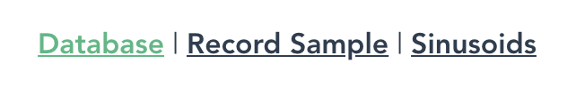

# Simple Shazam Clone
This project is a prototype of recreating the music recognition algorithm used in the Shazam-application. The goal was to test the theoretical knowledge about the algorithm described by Wang (Papers: "An industrial strength audio search algorithm, 2003" and "The Shazam music recognition service, 2006"), and to allow for a somewhat robust and accurate recognition of songs, which have been captured by a computer microphone. It is also meant to visualize every step needed for music recognition, so that users may have better insights into the algorithm itself. The project was a by-product of a paper I had to write for the course "Spezielle Gebiete der Mathematik" in the degree course "Medieninformatik Master" at TH-Köln, which involved describing the Shazam algorithm, possible improvements and other use cases (one possible use case for UI-Tests has also been implemented as a prototype and can be found [here](https://github.com/ddubbert/UI-Fingerprint)). In the following sections the prototype and its usage will be explained, followed by an installation guide. Because the algorithm used by Shazam wont be described further, it is highly recommended to have a look at the previously mentioned papers, before using this software.

# Table of Contents
* [Usage](#usage)
	* [Database](#database)
	* [Record Sample](#record_sample)
		* [Time Domain](#time_domain)
		* [Spectrum](#spectrum)
		* [Spectrogram](#spectrogram)
		* [Constellation Map](#constellation)
		* [Song Matching](#record_sample)
	* [Sinusoids](#sinusoids)
* [Project Setup](#project_setup)


## Usage <a name="usage"></a>
The prototype is a website consisting of three pages.

<div style="text-align:center"></div>

### Database <a name="database"></a>
On the "Database" page, a user can start to fill the database with songs, that are later used for recognizing recorded samples. On this page there are two options to choose from.

The first option is to upload new song files. The uploaded songs will be decoded by the prototype to generate fingerprints (robust hashes used for song recognition), that will be stored in a local object (used as a simple database). Depending on the length of a song and the processing power of the pc, this process might take multiple minutes (like 2 to 4 minutes for each song). Because decoded songs are only saved in a local object, all processed data will be lost on a page reload or server restart. That is why a .json file will be downloaded after all processing is done, which contains the processed data for a song (its name, length and all fingerprints / hashes). On a restart / reload, only these .json files need to be provided by using the second button, removing the need for processing a song again and again. These .json-files contain all information needed for song recognition and are uploaded in an instant (only milliseconds per song-file). If songs or their corresponding .json files were uploaded, this page will show a list of currently present songs, that can be recognized by the prototype. Remember that the name of uploaded files will be used as the song name. Also, the website might freeze for the time uploaded songs are decoded, so be patient and wait until all the names are shown inside of the database song list (until all .json-files are downloaded). This is only a prototype which has not been optimized very much. (Important files for this page are "src/views/RecordSong.vue" and "src/models/SongDatabase.ts")


### Record Sample <a name="record_sample"></a>
When songs have been uploaded, a song recognition can be done. The second page "Record Sample" provides all functionality needed to record a sample (corresponding files are "src/views/RecordSample.vue", "src/models/AudioProcessor.ts" and all components "src/compontents/*.vue").

First of all a user is allowed to choose the microphone that will be used for recording a sample, by using the dropdown menu. For the microphones to be recognized by the prototype, allowing all recordings for this website might be needed (in browser- or system settings). Next he can start a recording of his surrounding sounds, by clicking on the "Start recording" button. A 3 second countdown will start, before the recording itself begins, to allow for last adjustments. The recording itself lasts for 15 seconds and cant be canceled once started. The button will show the remaining time while the recording is active. After 15 seconds, the decoding of the recorded sample will start. The decoding takes a couple of seconds, depending on the processing power available. The text below the button will show the current process / step. When processing is done, a list of up to three possible matches will be displayed, ranked by a matching score. For each song, the song name, its length, its maximum matching score and the time offset of the sample compared to the original song will be displayed.

<a name="time_domain"></a>
Next all the steps used by the Shazam-Algorithm are visualy displayed. Drawing all of these will take some time, because a lot of data has to be visualized and only simple canvas implementations were used. Simply wait until all of the graphs are updated.
The first canvas that is visible will display the time domain of the recorded sample. The x-axis is representing the time, the y-axis the power of the audio-signal at each corresponding point in time (drawn with "src/components/WaveChart.vue").

<a name="spectrum"></a>
The next step / canvas presents the corresponding frequency domain / spectrum of the signal, showing all frequencies present in the recorded signal (x-axis), together with their magnitudes (y-axis). For calculating this spectrum, a FFT has been used (see function "calculateSpectrum" in the file "src/models/AudioProcessor.ts"). This step is not needed for the Shazam algorithm itself, but gives a nice impression of the overall sample (drawn with "src/components/FreqChart.vue").

<a name="spectrogram"></a>
Important for the Shazam algorithm is the calculation of a spectrogram (see function "calculateSpectrogram" in "src/models/AudioProcessor.ts"), where the spectrum is calculated for short time slices with the help of an STFT. The x-axis of this graph is the time, the y-axis the frequency and a heatmap shows the power of each frequency at each timeslice. The darker the color, the stronger the power of a frequency at that time. Here, the y-axis is reduced to the maximum frequency, that had a magnitude above a threshhold, so that not all the empty space above it will be drawn (drawn with "src/components/Spectrogram.vue").

<a name="constellation"></a>
Next up, the algorithm calculates a constellation map, which contains those points of the spectrogram, that provide the highest power in a short area around it. Wang called these points the spectrogram peaks. In this prototype, these points also have to be above a threshhold, so that no unimportant points in otherwise empty spaces will be created (see function "getConstellationPoints" in "src/models/AudioProcessor.ts"). The resulting graph is called constellation map, because it reminded Wang of a star (constellation) map (drawn with "src/components/ConstellationMap.vue").

<a name="song_matching"></a>
These constellation points are now used for a combinatorial hashing. For that, anchor points are selected and sequentially combined with points in a target zone behind it. The target zones size is determined by a fan out factor, which determins the number of points in such a zone. From these pairs hashes are created (fingerprints), containing the frequency of the anchor point, the frequency of the point from the target zone, and the time difference between these points. For every hash a hash-token object is generated, containing the hash itself and the time offset of the anchor point, which is needed for song matching (see function "calculateHashes" in "src/models/AudioProcessor.ts"). This step has no visualization and was therefore described in a little more detail.

After creating the hashes, they are send to the database, which tries to determine the best match (in this prototype a local file is used as database "src/models/SongDatabase.ts", function "getSongFor"). To do so, firstly all the hashes are compared to the hashes in the database, which simply is a lookup in an hashtable. In this hashtable, the hashes of the songs are saved, together with the song name they belong to. The matches for every song are collected. For every match, a new offset pair is generated, containing the offset from the song hash and the offset of the matching sample hash. After collecting all the matches, the matching factor is calculated for each song. Calculating this factor can be thought of as a two step process, even though in reality only the second one is needed (and used). First of, a scatterplot is created for the matching offset pairs of each song. This is illustrated for the best matching song of a request (drawn with "src/components/OffsetScatterplot.vue").

Each point represents a matching Hash between the sample and the current song. As you can see, there are quite a lot of matches. To determine, if it is a match, you need to look for points building a diagonal in this scatterplot. Here it is obviously around 100 seconds, which means that these are sequential points of the sample, that are also appearing in the original song in the same order and with the same timedifference between them, starting at around 100 seconds in the original. The amount of points in such a diagonal is used as the matching score of a song and the one with the highest score is chosen as match. Because these diagonals arent always as obvious as in this example and because this process needs to be automated, an additional approach to determine these diagonals is used. For each point of this scatterplot, the offset of the sample is subtracted from the original song offset, leaving the relative offset in between. These relative offsets are now used to create a histogram (drawn with "src/components/OffsetHistogram.vue").

If there is a high peak at one offset, it represents such a diagonal. The amount of this peak then is used as the total score of this song.

And again, the website might freeze for the time, a sample is decoded and drawn. Be patient and wait until everything is drawn, which might take a couple of seconds after the matches are displayed.

Options like a sampling rate for recording or the STFT window and hop sizes can be changed and tested in the file "src/models/ShazamConfig.ts". Remember to recalculate all of your songfiles if you do changes to these options.

### Sinusoids <a name="sinusoids"></a>
To demonstrate the way a DFT works, this page enables a user to create a signal from multiple waves with different frequencies. The sample rate and frequency can be chosen, as well as the type of the wave (sine or cosine) that will be added to the signal (see "src/views/SinusoidDrawer.vue").

The current combination of waves will be displayed in the time domain, which demonstrates how signals are joined. Following, a cosine wave with a frequency of 3Hz is drawn, and afterwards enhanced by a 10Hz sine wave.


The next canvas shows the spectrum / frequency domain of that signal. To calculate this spectrum, a DFT has been implemented (see "src/models/DFT.ts").

Lastly, a user can recreate the DFT manually, by drawing the signal around a circle with different circle frequencies. This is meant to enhance the understanding of the DFT itself (drawn with "src/components/Fourier.vue"). In the following images, three different frequencies are tested: 1Hz, 3Hz and 10Hz. 3Hz and 10Hz are present in the signal, which is shown by a shift of the mass center (circle in the center of the plot).


If the center of mass is shifted horizontally, it represents the frequency of a cosine wave. If it shifts vertically, it represents a sine wave. If a frequency is found within a cosine and sine part, the shift would be on both axis.

## Project setup <a name="project_setup"></a>
First of all, this project has only been optimized for and tested with Firefox and Chrome. If you want to try it, use one of these browsers.

```
npm install
```

### Compiles and hot-reloads for development
```
npm run serve
```

### Compiles and minifies for production
```
npm run build
```

### Lints and fixes files
```
npm run lint
```

### Website uses Port 8080 (localhost:8080)

### Customize configuration
See [Configuration Reference](https://cli.vuejs.org/config/).
